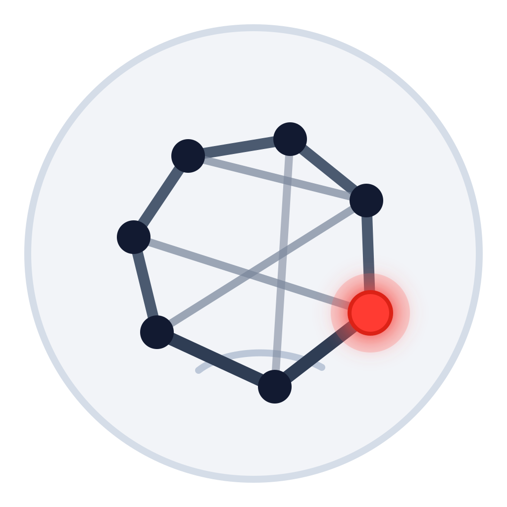

# Concept Synth

Public benchmark releases for Concept Synth / Concept Synthesis.

Contact: serafim.batzoglou@gmail.com

This repository is a public benchmark collection across Concept Synth task
families.

Current public releases:

- [`benchmarks/abduction/`](benchmarks/abduction/)
- [`benchmarks/induction/`](benchmarks/induction/)



## ABD

Paper: [arXiv:2602.18843](https://arxiv.org/abs/2602.18843)
Summary: [gist.science paper summary](https://gist.science/paper/2602.18843)

The ABD release ships canonical benchmark instances, matched holdout worlds,
released model predictions, a frozen evaluation cache, prompt examples, and a
runnable `concept_synth.abduction` package with the prompt builder, evaluator
CLI, checker, and parser support.

## INDUCTION

Paper: `INDUCTION: Finite-Structure Concept Synthesis in First-Order Logic`
(ICML 2026, spotlight)

The INDUCTION release ships canonical FullObs, CI, and EC benchmark instances,
released model prediction records, a frozen evaluation cache, prompt examples,
and a runnable `concept_synth.induction` package with prompt rendering, exact
finite-world evaluation, and deterministic generation of new schema-compatible
benchmark instances. It intentionally does not include model-running clients;
users should call models through their own infrastructure and evaluate the
resulting prediction JSONL files with the public CLI.

Current INDUCTION artifacts contain 775 benchmark instances and 11,413
released prediction/eval rows across 15 model identifiers, including Gemini
3.5 Flash.

Task-family-specific code lives in subpackages such as
`concept_synth.abduction` and `concept_synth.induction`.

All benchmark data, prompts, cached outputs, scripts, and code in this
repository are released under the MIT License unless noted otherwise.

Install from the repository root:

```bash
python3 -m venv .venv
source .venv/bin/activate
pip install -e ".[dev]"
```

Then, for example:

```bash
concept-synth-abd-build-prompt --instance-id ABD_FULL_TH10_000
./benchmarks/abduction/scripts/rebuild_eval_cache.sh --limit 5
./benchmarks/abduction/scripts/reproduce_tables.sh

concept-synth-induction-build-prompt \
  --dataset benchmarks/induction/data/induction_fullobs_v1.yaml.gz \
  --instance-id simple_001
concept-synth-induction-generate \
  --task all \
  --n 5 \
  --seed 20260516 \
  --validate \
  --output benchmarks/induction/generated_instances/induction_generated_sample.yaml
./benchmarks/induction/scripts/rebuild_eval_cache.sh --limit 5 --no-diagnostics
./benchmarks/induction/scripts/reproduce_tables.sh

pytest -q
```
